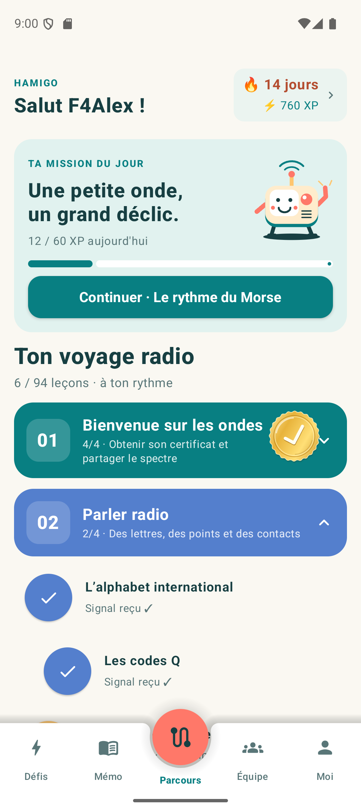
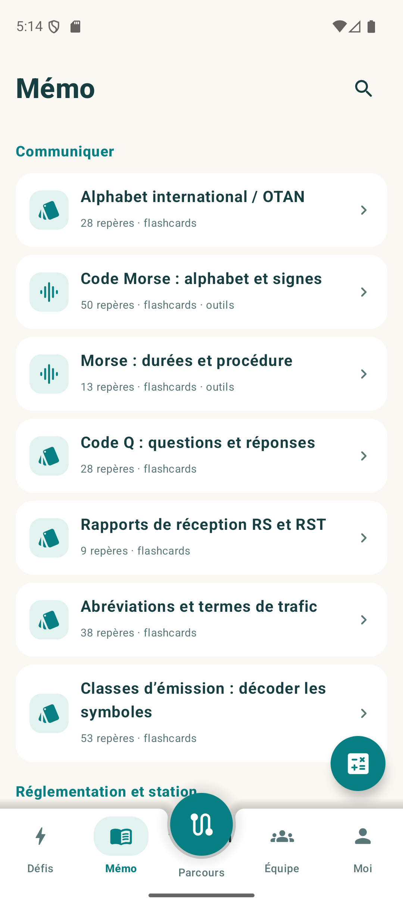
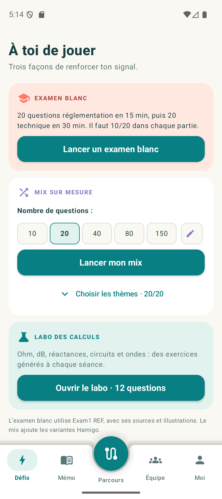
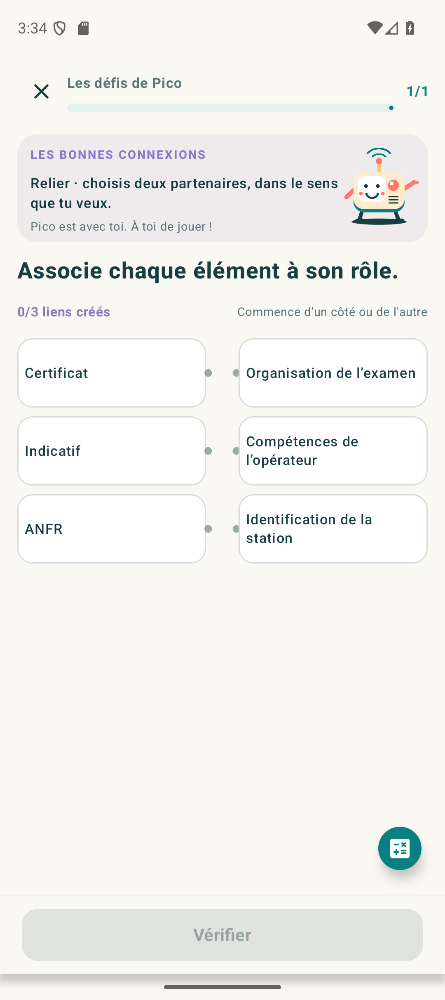
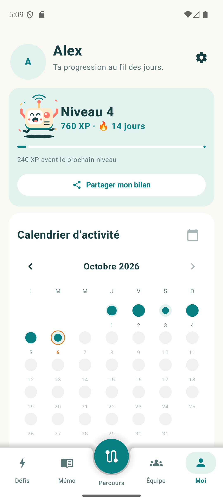
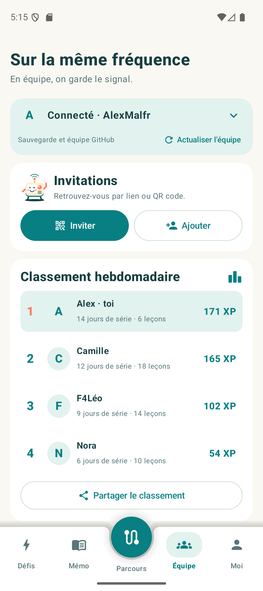
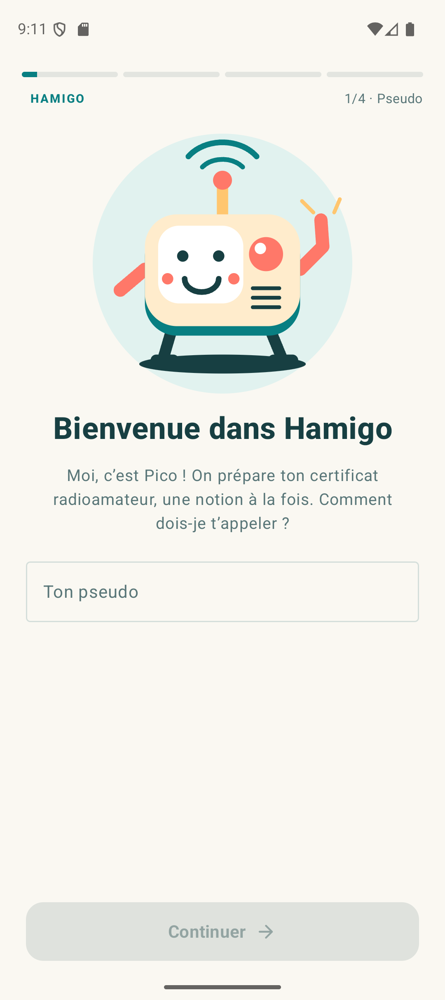
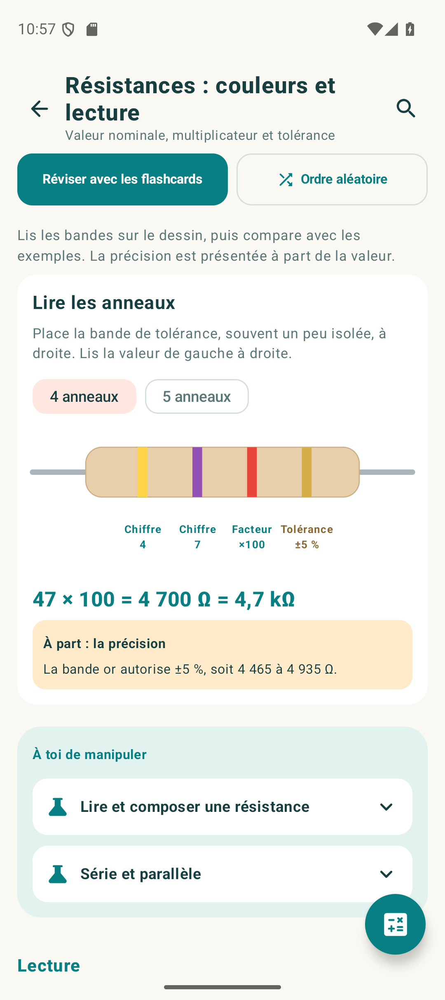

> [!WARNING]
> **Vibe codée avec ❤️ par [@AlexMalfr](https://github.com/AlexMalfr).**
> Hamigo est entièrement développée avec des agents IA (Codex), à partir d’idées, de retours et de tests humains.
>
> Je ne connais rien en RF (radiofréquences) : c’est justement pour apprendre que j’ai créé cette app. **Le contenu pédagogique peut contenir des erreurs.** Vérifie les notions importantes avec les cours de référence et les sources officielles.

# Hamigo 📻

**Apprends le radioamateurisme, une leçon à la fois.**

Hamigo est une application Android en français pour préparer le **certificat d’opérateur des services d’amateur**. Des leçons interactives, des révisions espacées et Pico, une petite radio qui t’accompagne dans ton apprentissage.

**[Télécharger l’APK](https://github.com/AlexMalfr/Hamigo/releases/latest)** · [Signaler un problème](https://github.com/AlexMalfr/Hamigo/issues) · [Documentation détaillée](docs/APP-DETAILS.md)

## Ce qu’on peut faire

- **Apprendre** avec un parcours de 22 chapitres et 97 leçons : réglementation, électricité, radio, Morse et binaire/portes logiques. Le menu de chaque leçon permet de relire le cours et ses fiches mémo sans lancer les questions.
- **Manipuler** des quiz variés : associations et étapes à glisser, textes à trous, résistances, fréquences, calculs et écoute ou composition de Morse. Pico lit les énoncés avec une préparation des signaux Morse, formules et unités. Les formules reconnues affichent leurs fractions, racines et indices. Le réglage de fréquence peut mêler souffle et voix, comme un petit récepteur.
- **Préparer ses réponses** avec une calculatrice scientifique et un brouillon au clavier, au doigt ou au stylet, remis à zéro à chaque question.
- **Réviser** avec 40 fiches mémo, des flashcards et des outils interactifs : calculatrice, résistances, décibels, traducteur Morse, portes logiques… Pico accompagne les cours et les flashcards avec des expressions et des réactions discrètes.
- **S’entraîner** en examen blanc, avec un mix sur mesure ou des révisions aléatoires des notions étudiées, qui mélangent les rappels de la répétition espacée.
- **Garder le rythme** avec un objectif quotidien, des XP, une série de jours, un calendrier, des rappels et des widgets redimensionnables, avec un fond transparent facultatif par widget.
- **Ressentir les interactions** avec de petits sons inspirés des commandes radio, des vibrations mesurées et des confettis de fin de séance. Sons et vibrations se désactivent séparément ; la composition Morse peut être écoutée en direct, avec un réglage dédié.
- **Jouer en équipe** : comparer les progrès de ses amis, les ajouter par lien ou QR et partager un bilan en image.
- **Faire un retour** depuis une question ou une fiche mémo : son identifiant accompagne le lien de contact ; pour Exam1, l’app propose aussi le contact de la banque originale.

Les révisions s’adaptent aux réponses. Une leçon demande au moins 80 % de bonnes réponses au premier essai et la correction des erreurs pour être validée.

## En images

Captures de l’application sur émulateur, avec des profils de démonstration. Clique sur une image pour l’agrandir.

| Parcours | Mémo | Défis |
|:---:|:---:|:---:|
| <a href="docs/screenshots/parcours.png"></a> | <a href="docs/screenshots/memo.png"></a> | <a href="docs/screenshots/defis.png"></a> |
| **Exercices interactifs** | **Moi** | **Équipe** |
| <a href="docs/screenshots/exercice.png"></a> | <a href="docs/screenshots/progression.png"></a> | <a href="docs/screenshots/equipe.png"></a> |

<details>
<summary>Voir aussi l’accueil et les outils des fiches mémo</summary>

| Premiers pas avec Pico | Résistances en couleurs |
|:---:|:---:|
| <a href="docs/screenshots/accueil.png"></a> | <a href="docs/screenshots/resistances.png"></a> |

</details>

## Installer Hamigo

**Android 8.0 ou plus récent.** Télécharge le fichier `Hamigo-…apk` depuis la [dernière release](https://github.com/AlexMalfr/Hamigo/releases/latest), puis installe-le sur ton téléphone.

Au premier lancement, tu choisis ton pseudo, ton objectif et l’heure de ton rappel. La connexion GitHub est proposée ensuite ; elle reste facultative. Les cours, les fiches et les révisions fonctionnent **hors ligne**.

## Sauvegarde et équipe

GitHub sert à retrouver sa progression sur plusieurs appareils et à partager ses statistiques avec ses amis, sans serveur applicatif Hamigo.

Deux Gists séparés conservent la sauvegarde complète et le résumé social. Ils sont **non répertoriés, mais accessibles à toute personne possédant leur lien** ; la sauvegarde n’est pas chiffrée. L’invitation ne donne accès qu’au résumé social.

Pour les échanges, les demandes d’amis et la fusion des sauvegardes : [fonctionnement de la synchronisation](docs/SOCIAL.md).

## Développer

Ouvre le projet dans Android Studio avec **JDK 17 ou plus** et le **SDK Android 36**. Configure le chemin du SDK dans `local.properties` ou `ANDROID_HOME`, puis :

```sh
./gradlew :app:assembleDebug :app:testDebugUnitTest
```

Sous Windows, utilise `gradlew.bat`. L’APK debug est généré dans `app/build/outputs/apk/debug/`.

La signature, la configuration OAuth, les versions et les vérifications Android sont expliquées dans [les notes techniques](docs/APP-DETAILS.md) et [la documentation OAuth](docs/GITHUB-PKCE.md).

Pour tester directement un identifiant de question, parcourir les formats ou inspecter des données fictives sans modifier sa progression : [outils de diagnostics sur appareil](docs/DIAGNOSTICS.md). Pour personnaliser le fond des widgets : [configuration des widgets](docs/WIDGET-CONFIGURATION.md).

Les questions originales du Parcours utilisent des [UUID stables séparés de leur position](docs/QUESTION-IDENTITIES.md). Déplacer une question conserve son historique ; les sauvegardes antérieures sont converties pendant la fenêtre 0.47–0.51.

## Sources et documentation

Hamigo est un projet indépendant de l’ANFR. Le contenu continue d’être revu et enrichi.

- [Cours F6KGL / F5KFF](http://f6kgl.free.fr/COURS.html) — référence pédagogique, sous **CC BY-NC-SA 4.0** ; [attributions et textes officiels](docs/SOURCES-COURSES.md).
- [Exam1 REF](https://exam1.r-e-f.org/) — banque communautaire d’entraînement ; [provenance et statut des ressources](docs/SOURCES-EXAM1.md).
- [ANFR](https://www.anfr.fr/gerer/radioamateurs/les-certificats) — informations officielles sur le certificat.

Pour aller plus loin : [couverture des fiches mémo](docs/MEMO-COVERAGE-2026-10.md) · [validation et limites](docs/VALIDATION.md) · [historique des mises à jour](docs/UPDATES-2026-10.md) · [consignes de contribution pour les agents](AGENTS.md).
