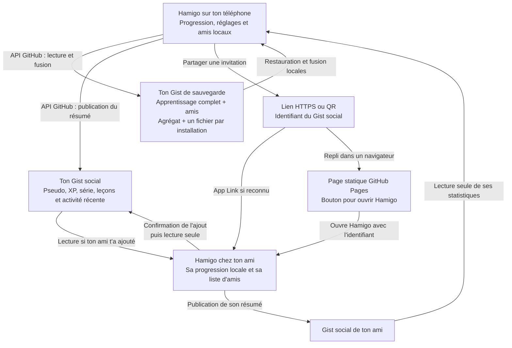
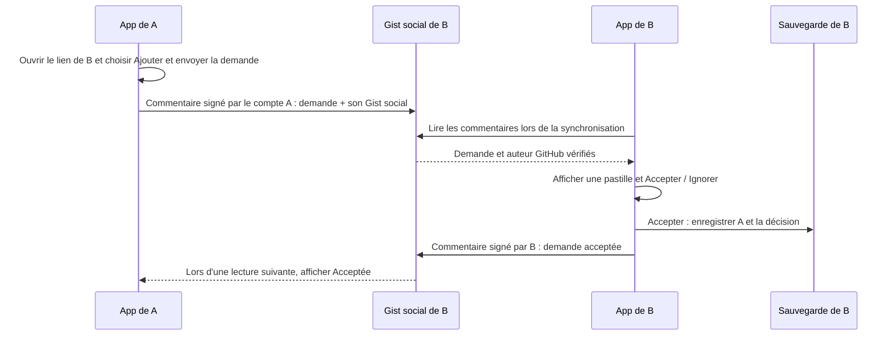

# Progression, synchronisation et invitations

Hamigo reste utilisable hors ligne et enregistre immédiatement l’apprentissage local. En examen blanc, les brouillons de la partie courante sont enregistrés à sa finalisation ou à l’expiration du temps. La connexion facultative autorise uniquement le scope `gist` avec l’application OAuth Hamigo commune.

Le parcours Authorization Code + PKCE utilise cette application OAuth commune et un Auth Tab du navigateur par défaut, avec repli Custom Tabs : autorisation sur GitHub puis retour dans Hamigo sans code à recopier. Son client secret commun a été généré avec l'autorisation de l'utilisateur le **5 octobre 2026** et renseigné dans `.tools/oauth.properties`, ignoré de Git. Le build local est ainsi configuré pour intégrer le paramètre dans l'APK et activer ce parcours pour toutes ses installations. GitHub exige ce paramètre pour l'échange natif ; il est extractible de l'APK, conformément à son modèle de client public, et ne remplace jamais le jeton utilisateur protégé par Keystore. Les utilisateurs n'ont aucun secret personnel à fournir. Une compilation sans cette configuration conserve Device Flow. Voir [la configuration, les protections et les limites de validation PKCE](GITHUB-PKCE.md).

Le 5 octobre, l'APK release signé **0.10+4a37256b** a validé le parcours direct sur le Samsung : déconnexion locale puis nouvelle connexion du compte AlexMalfr, retour automatique, fermeture du Custom Tab observé et première synchronisation réussie. La pile ne conservait qu'une `MainActivity` et aucun onglet navigateur dans sa tâche. Les 386 XP et trois leçons étaient conservés ; après arrêt forcé et relancement, le compte restait connecté et une nouvelle synchronisation était affichée. Ce compte avait déjà autorisé Hamigo : cette vérification ne couvre pas le consentement d'un nouvel utilisateur ni une nouvelle saisie de mot de passe ou de double authentification.

## Repli Device Flow et reprise réseau

Après réception du code, Hamigo ouvre immédiatement `https://github.com/login/device` dans un **Android Custom Tab du navigateur par défaut** : même moteur, cookies et session que le navigateur habituel, avec son bouton X. Il n'y a ni écran d'introduction supplémentaire, ni WebView, ni injection JavaScript. Aucun navigateur particulier n'est imposé. Si le navigateur choisi ne prend pas en charge Custom Tabs, l'intent reste compatible avec son ouverture ordinaire. Voir [Custom Tabs](https://developer.chrome.com/docs/android/custom-tabs).

Le code affiché conserve la forme XXXX-XXXX. Les huit caractères utiles sont copiés automatiquement dans le presse-papiers, sans tiret. Hamigo demande une action de barre haute montrant les deux groupes de quatre caractères à côté de l'icône de copie ; sa description accessible contient le code entier. Les Custom Tabs limitent cette action à 48 × 24 dp et le navigateur décide de son emplacement. Une barre secondaire fournit donc aussi le code complet en 22 sp, un bouton **Copier** et l'indication **Première case : appui long → Coller**. Le menu contient une autre action de copie. Les navigateurs peuvent ignorer certaines personnalisations ; le code et les commandes restent également dans la carte Équipe. Voir les [actions et barres Custom Tabs](https://developer.chrome.com/docs/android/custom-tabs/guide-interactivity).

Le formulaire GitHub authentifié observé le 4 octobre utilise `.js-user-code-field` et le [script public `user-code-prompt-870b382dfe55fec4.js`](https://github.githubassets.com/assets/user-code-prompt-870b382dfe55fec4.js). Son changement de case écoute uniquement `keyup`, avec un code de touche de lettre ou chiffre physique ; il ne traite ni `input`, ni `beforeinput`, ni `compositionend`. Son handler `paste` lit `clipboardData`, enlève les séparateurs non alphanumériques et répartit jusqu'à huit caractères entre les cases. Les tirets et espaces ne sont donc pas la cause du collage défaillant.

Le 5 octobre, le nouveau [script public `user-code-prompt-fb0c172c6a70280b.js`](https://github.githubassets.com/assets/user-code-prompt-fb0c172c6a70280b.js) conserve les mêmes handlers `keyup` et `paste` propres aux cases. Le flux PKCE évite ces cases ; il ne prétend pas corriger le JavaScript du formulaire GitHub.

Les claviers Android peuvent insérer du texte via l'IME sans événement de touche physique ni événement `paste`, notamment depuis leur propre presse-papiers. Le traitement du formulaire ne couvre pas ces insertions, ce qui correspond au défaut de focus et de collage rapporté. Android recommande précisément aux IME d'utiliser `commitText` plutôt que des événements de touches : voir [InputMethodService](https://developer.android.com/reference/android/inputmethodservice/InputMethodService) et [KeyEvent](https://developer.android.com/reference/android/view/KeyEvent). Le contournement consiste à faire **appui long → Coller dans la première case**, pour déclencher le collage natif que GitHub répartit. Copier sans tiret reste valide, mais ne corrige pas les handlers du site. Custom Tabs ne permet pas à Hamigo d'injecter une correction JavaScript dans GitHub ; voir les [possibilités et limites de Custom Tabs](https://developer.chrome.com/docs/android/custom-tabs). Aucun préremplissage par URL n'est présenté comme fonctionnel : il n'est pas documenté dans le Device Flow GitHub ni démontré par les observations.

Dès la réception du jeton, une commande collectée hors du cycle de recomposition ramène l'activité Hamigo existante par CLEAR_TOP/SINGLE_TOP et ferme le Custom Tab qui la recouvre. L'état « Vérification du compte », puis la première sauvegarde, continuent dans Hamigo : une sauvegarde lente ne maintient pas l'onglet ouvert. Le résultat de l'activité navigateur signale sa fermeture réelle ; un simple retour de Hamigo au premier plan ne fait plus perdre le suivi de l'onglet. L'onglet n'utilise pas NO_HISTORY, afin qu'un détour par un gestionnaire de mots de passe ou une application de double authentification ne le supprime pas. Fermer l'onglet avec X conserve le polling ; le code, la copie, la réouverture et l'annulation sont accessibles dans la carte Équipe. L'autorisation peut ainsi être terminée depuis un autre appareil. L'utilisateur reste responsable du consentement sur GitHub.

Le polling respecte l'intervalle fourni par GitHub et augmente cet intervalle après `slow_down`. Une interruption réseau, HTTP 429 ou une erreur 5xx laisse la session en attente, avec délai croissant plafonné à 30 secondes pour la composante de reprise réseau, jusqu'à expiration du code. Les refus d'autorisation et codes expirés restent des erreurs explicites. Les réponses OAuth HTTP 400 contenant le protocole d'attente sont décodées, au lieu d'être réduites à une erreur HTTP générique.

Après réception du jeton, la vérification du compte fait au plus trois essais en cas d'erreur réseau. Le jeton validé est conservé même si la première synchronisation échoue avec une erreur API/réseau ; un travail persistant demande alors une nouvelle tentative. Cela distingue l'autorisation, l'identité du compte et la publication des Gists. Le 4 octobre, l'utilisateur a confirmé une autorisation depuis son navigateur PC : le Samsung a affiché « Connecté » et deux Gists Hamigo ont effectivement été créés sur son compte, non répertoriés. Cela valide ce parcours Device Flow, sans démontrer la cause exacte de l'ancien incident ni une restauration après réinitialisation.

## Deux Gists distincts

- `hamigo-progress.json` contient le résumé partageable : pseudo, XP, série, nombre de leçons terminées, XP de la semaine, date de mise à jour et jusqu'à 30 jours de points journaliers pour les graphiques. Il ne contient ni réponses, ni échéances SRS, ni jeton.
- `hamigo-backup.json`, dans un **autre Gist**, contient la progression complète : XP et jours actifs, compteurs de réponses, leçons terminées, révisions SRS, historique des nouveaux événements, pseudo, préférences d'objectif/rappel et relations d'équipe. Il est retrouvé avec le même compte GitHub sur une nouvelle installation, y compris les amis. Le jeton OAuth et les clés Keystore ne font pas partie de cette sauvegarde.
- Chaque installation conserve aussi son fichier `hamigo-device-<UUID>.json` dans le Gist de sauvegarde. Un PATCH ne touche que le fichier de cette installation et le résumé agrégé. Les autres fichiers restent intacts, conformément au [contrat PATCH des Gists](https://docs.github.com/en/rest/gists/gists#update-a-gist). Cela conserve les événements de deux appareils qui publient simultanément.

Les deux Gists sont créés avec `public: false`, donc **secrets / non répertoriés**. GitHub ne propose pas de Gist réellement privé : une personne ayant son URL peut le lire, et GitHub garde son historique. La sauvegarde complète n'est pas chiffrée. Son identifiant n'est jamais inclus dans l'invitation d'amis, le QR code ou l'image partagée. L'interface doit annoncer ces propriétés sans qualifier la sauvegarde de « privée ». Voir la [confidentialité des Gists](https://docs.github.com/en/get-started/writing-on-github/editing-and-sharing-content-with-gists/creating-gists).

Les liens des deux Gists personnels se trouvent dans **Réglages → Sauvegarde manuelle**, après dépliage des options. Le menu ⋮ de chaque ami propose **Ouvrir le Gist social** et **Retirer cet équipier**. Ces liens sont reconstruits depuis des identifiants validés vers `https://gist.github.com/` ; afficher les options n'effectue aucune découverte réseau ni création de Gist.

Les flèches correspondent à des appels REST à GitHub, pas à des opérations Git `pull`/`push`. Chaque utilisateur possède également son propre Gist de sauvegarde ; celui de l'ami est omis pour garder le schéma lisible. L'image partagée est générée localement et envoyée via le menu Android ; elle ne déclenche aucune écriture dans le Gist d'un autre utilisateur.

La suppression locale de la connexion supprime le jeton et les travaux programmés ; elle ne détruit pas les Gists sur GitHub. L'utilisateur peut supprimer les Gists depuis son compte. Une autorisation expirée demande une nouvelle connexion.

## Déclencheurs et fréquence

La lecture de la sauvegarde personnelle, sa fusion avec les données locales, puis l'écriture de la sauvegarde complète et du résumé social se font :

1. lors de la connexion GitHub ;
2. au retour de l'application au premier plan ;
3. à la fin d'une session ou en la quittant ;
4. sur l'action explicite d'actualisation de l'équipe ;
5. après les réponses d'entraînement enregistrées, ou la finalisation d'une partie d'examen, via un travail persistant retardé de **8 secondes après la dernière mutation** ;
6. en arrière-plan, avec un travail unique demandé **toutes les heures**, dans une fenêtre flexible de 15 minutes.

Les actualisations de l'équipe relisent les résumés des amis et conservent leur dernière carte si un ami est inaccessible. Le travail en arrière-plan actualise aussi ces cartes. Une modification du pseudo, de l'objectif, des rappels ou une restauration programme également le même déclencheur persistant à huit secondes. Sans connexion GitHub, les amis se relisent au premier plan ; le travail périodique est réservé aux comptes connectés.

Le travail persistant demande une connexion réseau et une batterie suffisamment chargée. Ce n'est pas un minuteur exact : Android peut le retarder avec Doze et les restrictions constructeur. Les erreurs réseau temporaires provoquent au maximum trois nouvelles tentatives avec délai croissant. Désactiver la synchronisation automatique annule les deux travaux ; l'actualisation explicite demeure possible. Voir les [contraintes et travaux périodiques WorkManager](https://developer.android.com/develop/background-work/background-tasks/persistent/getting-started/define-work).

## Fusion entre appareils

`CloudProgress` conserve un socle pour les données antérieures à la mise à jour. Les anciens totaux et XP journaliers se fusionnent par maximum, et les leçons terminées par union : l'ancien format ne permet pas de distinguer deux historiques indépendants qui avaient déjà été cumulés.

Les nouvelles tentatives sont des événements immuables identifiés par UUID. Leur union additionne les réponses sans les compter à nouveau lors d'une seconde lecture. L'XP associé à la même question et au même jour se fusionne par maximum ; le bonus d'une même leçon n'est attribué qu'une fois. Chaque révision porte une date de modification : la plus récente gagne, avec une règle déterministe en cas d'égalité. Le pseudo et les préférences sont horodatés uniquement lorsque l'utilisateur les modifie, afin que les valeurs par défaut d'un nouvel appareil n'écrasent pas le profil existant.

Les amis se fusionnent par identifiant canonique du Gist social. Des ajouts indépendants sont conservés ; une suppression laisse une trace horodatée, qui gagne sur un ancien ajout et sur un ajout de date identique. Un réajout explicite plus récent est accepté. Actualiser les statistiques d'un ami ne change jamais la date de la relation. Le cache se fusionne par date de publication pour une même version de relation ; un réajout repart avec son nouveau cache. Les anciennes sauvegardes sans champ `friends` préservent les relations locales. Une importation manuelle d'une sauvegarde au nouveau format remplace explicitement la liste et ses traces de suppression ; la synchronisation GitHub, elle, fusionne. La limite est de trente amis actifs et deux mille relations, suppressions comprises. En cas de dépassement par ajouts concurrents, les trente relations les plus récentes sont conservées ; les autres deviennent des suppressions persistantes.

Le pseudo et le bloc entier des préférences utilisent la modification la plus récente, pas une fusion champ par champ. Ces décisions reposent sur l'heure des appareils. La progression n'a pas encore de génération de remise à zéro : un autre appareil hors ligne conservant un ancien apprentissage peut le réintroduire. Une remise à zéro complète doit donc couvrir l'état local actif et tous les fichiers de sauvegarde lus par l'app ; un simple fichier vide est normalement fusionné avec les événements existants. Les anciennes révisions des Gists restent dans l'historique GitHub, que Hamigo ne consulte pas pour restaurer.

Les fichiers de tous les appareils sont fusionnés à chaque lecture, puis republient une vue agrégée. Les lectures et mutations locales sont protégées par `Progress.CLOUD_LOCK`, et les publications dans un même processus par une coroutine `Mutex`. Le Gist n'est pas une base transactionnelle : une activité locale survenant pendant une publication peut attendre la prochaine actualisation, mais ses événements restent conservés localement et dans le fichier de son appareil dès publication. Aucune fusion ne remplace aveuglément l'état local par le dernier fichier reçu.

Un écouteur des préférences rafraîchit les valeurs affichées lorsqu'un travail termine alors que la page reste ouverte. Il recharge la progression et les équipiers sans déclencher une nouvelle synchronisation, pour éviter une boucle de publications. Les cartes d'amis plus récentes ne sont pas remplacées par un ancien retour réseau.

## Lien HTTPS et QR code

`FriendInvite.link` produit `https://alexmalfr.github.io/hamigo/?invite=<identifiant-du-Gist-social>`. Ce lien peut circuler dans Discord et les autres messageries qui reconnaissent HTTPS. Android App Links ouvre Hamigo ; la page statique GitHub Pages propose aussi un bouton vers `hamigo://join?invite=...`. Si l'application est absente, elle invite à demander l'APK à l'ami : les releases restent dans le dépôt privé. Le fichier `/.well-known/assetlinks.json` lie le domaine au package Android et au certificat de signature. Aucun serveur applicatif n'est nécessaire.

L'identifiant dans le lien est bien celui du Gist social : l'URL complète n'y figure pas, mais on peut la reconstruire à partir de cet identifiant. Il n'est ni chiffré ni secret. L'app valide l'invitation et lit le résumé après confirmation. **Ajouter seulement** crée une relation à sens unique. Avec GitHub connecté et un Gist social créé, **Ajouter et envoyer la demande** ajoute l'ami puis envoie une demande pour établir l'autre sens. Chacun garde la maîtrise de sa liste ; les fichiers de l'autre utilisateur ne sont jamais modifiés.

## Demandes réciproques

Les commentaires des Gists sociaux servent de boîte de réception, via [l'API GitHub des commentaires](https://docs.github.com/en/rest/gists/comments). Aucun troisième Gist ni serveur applicatif n'est nécessaire. Une demande contient un UUID et les identifiants des deux Gists sociaux. GitHub fournit l'identité de l'auteur du commentaire ; Hamigo vérifie que son identifiant numérique est celui du propriétaire du Gist social annoncé. Un nom ou une URL fournis dans le corps ne suffisent pas à établir une identité.

Les demandes reçues apparaissent dans Équipe, avec la photo et le compte de leur auteur. Une pastille indique leur nombre sur l'onglet. **Accepter** vérifie de nouveau la source, enregistre localement l'ami et la décision ensemble, puis tente de publier une confirmation sur le propre Gist social du destinataire. Un échec de cette confirmation ne retire pas l'ami ; la confirmation pourra être réessayée lors d'une actualisation. **Ignorer** sauvegarde la décision sans publier de refus. Les demandes envoyées se consultent dans une section repliable ; un envoi échoué propose **Réessayer**. Relire ou importer une sauvegarde n'envoie jamais automatiquement de nouvelles demandes.

Le champ de sauvegarde `socialInbox` conserve les décisions et les états d'envoi, avec des règles de fusion déterministes. Les demandes reçues restent un cache local attaché au compte et au Gist social courant. Les clés de décision incluent destinataire, expéditeur et UUID : copier un UUID public sous un autre compte ne masque pas la demande authentique. Les anciennes demandes d'un expéditeur déjà traitées, ou antérieures à son retrait, ne le réajoutent pas. L'identifiant conservé lors d'une reprise évite de publier deux fois après une réponse réseau perdue.

Le transport expire les demandes après trente jours, lit au plus cent demandes candidates et refuse une boîte atteignant mille commentaires plutôt que de publier sans pouvoir vérifier les doublons. Les décisions et suivis sont bornés et les données de plus de soixante jours sont élaguées. Les autres commentaires et les formats invalides sont ignorés. Les vérifications accompagnent les synchronisations au premier plan et en arrière-plan ; la pastille n'est donc pas une notification push instantanée. Les commentaires sont lisibles avec le lien du Gist social. GitHub peut aussi produire ses notifications habituelles. Le nettoyage des commentaires n'est pas automatisé dans cette version.

## Photos et profils GitHub

Les photos circulaires viennent de l'identité vérifiée par `/user` pour son propre compte et du propriétaire renvoyé par `/gists/<id>` pour les amis. Les URLs de profil sont reconstruites sur `github.com` et les avatars sur `avatars.githubusercontent.com` à partir de l'identifiant numérique, sans réutiliser une URL arbitraire du résumé. Les images utilisent un transport séparé sans jeton, sans redirections, avec limites de téléchargement et de décodage, cache mémoire/disque et initiales de repli. L'identité des amis reste un cache local réenrichi après restauration, pour que les anciennes versions puissent encore lire les relations sauvegardées.

Moi, Équipe et les réglages affichent sa photo. Le menu d'un ami ouvre son profil ou son Gist social ; **Retirer cet équipier**, en rouge, ouvre une confirmation avant de créer la suppression persistante.

Le QR code encode exactement le même lien HTTPS, avec une marge blanche et une correction d'erreur M. L'appareil photo du téléphone suffit pour le lire ; Hamigo ne demande donc pas une permission caméra uniquement pour partager son invitation. Le parseur refuse les hôtes différents, les identifiants invalides, les URL contenant des identifiants de connexion, les fragments et les paramètres ambigus/répétés. L'import de profils via JSON est supprimé. Une sauvegarde JSON complète reste un outil avancé de migration, distinct du partage social.

Les actions de partage utilisent des libellés différents selon leur contenu : **Partager mon bilan** dans Moi, **Partager le classement** dans Équipe, **Partager mes résultats** à la fin d'un examen ou mix, et **Partager mon parcours** après une leçon ou des flashcards. Les images sont rendues localement et passées au menu de partage Android ; elles contiennent leurs graphiques et ne portent aucun jeton ni identifiant du Gist de sauvegarde. Le graphique de Moi permet également de remonter l'historique local par plages de sept jours ; le résumé social conserve un historique récent borné.

## Protection du jeton et limites

Le jeton est chiffré en AES-256-GCM dans les préférences privées, avec une clé Android Keystore et un IV aléatoire. Il n'est ni journalisé, ni exporté, ni inclus dans les Gists. Les appels API reconstruisent l'hôte fixe `api.github.com` après validation de l'identifiant ; une URL d'invitation n'est jamais appelée avec le jeton. Les lectures d'amis utilisent la connexion GitHub lorsqu'elle existe, sinon elles sont anonymes et soumises au plafond anonyme de GitHub. Voir [Android Keystore](https://developer.android.com/privacy-and-security/keystore).

Le transport API/OAuth utilise **OkHttp**, avec appels annulables lorsque la coroutine est annulée, un délai de connexion de 15 secondes, de lecture de 20 secondes et un plafond de 30 secondes par appel. Les redirections HTTP et HTTPS sont refusées. Les réponses API sont bornées à 20 Mio, OAuth à 128 Kio et les sauvegardes brutes à 8 Mio. Les erreurs DNS, délai dépassé et TLS sont distinguées des refus API, sans enregistrer le corps des credentials.

Une sauvegarde est bornée à 8 Mio et 100 000 nouveaux événements, avec au maximum 20 000 révisions. Une sauvegarde tronquée par l'API Gist est lue uniquement sur une URL `gist.githubusercontent.com` strictement validée à partir de l'identité, du Gist, de sa révision et du nom de fichier ; cette lecture brute ne porte aucun jeton. Le format social est borné à 32 Kio et accepte les anciens résumés de schéma 1 ainsi que le schéma 2 avec graphiques.

## Vérification

`CloudSyncInstrumentedTest` vérifie hors réseau la fusion commutative et idempotente, les événements de deux appareils, la déduplication XP question/jour et bonus de leçon, les anciens socles, le choix des révisions/préférences, le rejet des données malformées, les liens d'invitation et le décodage réel du QR produit. Les tests de plateforme existants couvrent le chiffrement du jeton, les URI de partage et les rappels. Ces tests n'utilisent aucun compte réel et ne publient aucun Gist.

`AuthFlowInstrumentedTest` utilise un serveur HTTP local pour les scénarios OAuth d'attente, de ralentissement, de coupure puis reprise, d'annulation et de refus des redirections ; il couvre aussi le format des PATCH et une restauration entre installations fictives. `GitHubBrowserInstrumentedTest` contrôle l'intent du navigateur par défaut, l'absence de mode éphémère, la copie et le retour depuis un vrai Custom Tab à réception d'une commande synthétique de fin. L'inspection du formulaire GitHub et de ses scripts publics identifie séparément le défaut de compatibilité IME ; aucune saisie ni soumission n'a été effectuée lors de cette inspection du compte utilisateur. Les scénarios réseau réel de `LiveGitHubTransportInstrumentedTest` sont séparés, réservés à un audit explicitement activé sur émulateur : attente `authorization_pending`, puis Gists temporaires d'audit avec données fictives et nettoyage. Ces fixtures restent distinctes du consentement personnel confirmé via le PC ; les résultats effectivement exécutés sont dans [VALIDATION.md](VALIDATION.md).
